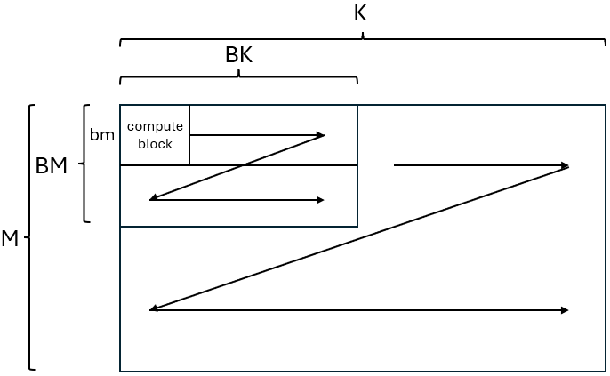
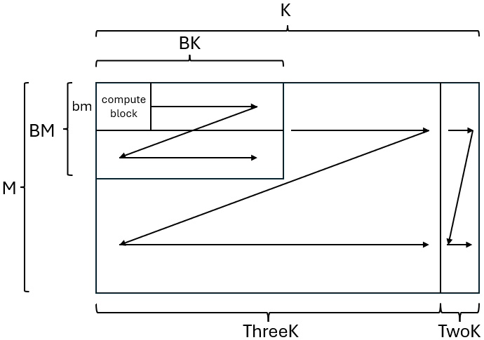

Codegen for TL1 and TL2
------------------------

codegen_tl1.py and codegen_tl2.py are using params to generate kernel codes in different devices to achieve fastest performance for TL1 and TL2.

We cutting weight into multiple compute blocks to best utilize hardware capabilities.

### Example
bitnet_b1_58-large:

- Make sure Matmul kernels shapes \
For example, bitnet_b1_58-large Matmul kernel shapes are:\
[1536, 4096]\
[1536, 1536]\
[4096, 1536]

- Make sure each BM, BK, bm for each kernel to meet the requirements below
- Generate codes\
For example, for bitnet_b1_58-large, we can gencode like:

```bash
# For TL1
python utils/codegen_tl1.py --model bitnet_b1_58-large --BM 256,128,256 --BK 128,64,128 --bm 32,64,32

# For TL2
python utils/codegen_tl2.py --model bitnet_b1_58-large --BM 256,128,256 --BK 96,192,96 --bm 32,32,32
```

### TL1:


For TL1, we cut weight into M / BM weights, each weight shape is (BM, K). Then we cut weight into K / BK weights, each weight shape is (BM, BK). As for (BM, BK) weight, we cut it the same way into (bm, compute_num / bm) compute blocks, and finish computing in it.

Thus, we need to make sure 
- M % BM == 0
- K % BK == 0
- BM % bm == 0
- bm choose in [32, 64]

### TL2:


For TL2, things got a little more complicated. Due to TL2 needs BK % 6 == 0, we need to split K into threeK and twoK, in which compute in TL2 for (M, threeK), compute in TL1 for (M, two_K).

Thus, we needs to make sure
- M % BM == 0
- K % BK % 32 == 0
- BM % bm == 0
- bm choose in \[32\]